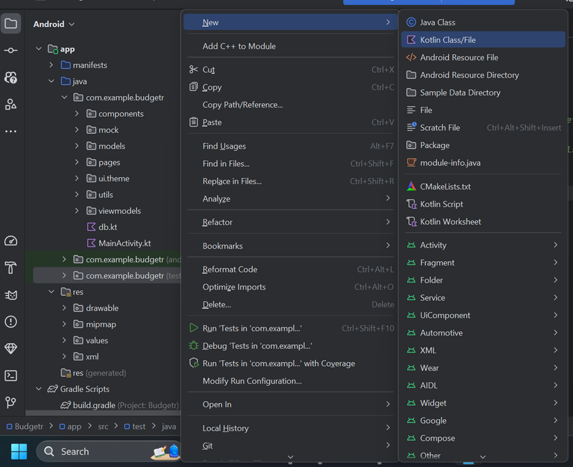
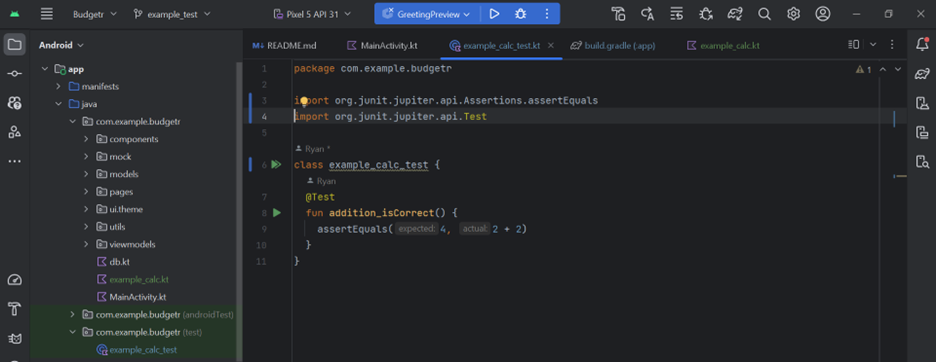
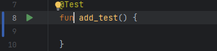
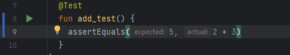

# 
Requirements

## Team Info & Policies
**Team Members:**
1. Ryan Doyle
1. Josh Delva
1. David Weisman
1. Jahidul Robin
1. Mit Patel

**GitHub:**
Repo [link](https://github.com/ryandoyle5401/Budgetr.git)

**Roles:**
- UI Designer/Frontend - Ryan, Josh
- Backend - Josh, Mit
- Database - David, Robin

**Communication:**
We will establish a diverse array of communication channels to facilitate seamless interaction among team members. These resources include a group chat, Discord calls, and in-person meetings. As a cohesive team, our objective is to uphold regular communication, striving for daily or, at the very least, bi-daily engagement to ensure a dynamic and well-connected working environment. 
 
## Product Description
Budgetr stands as an innovative financial management application empowering users to create a personalized budget. This comprehensive tool not only streamlines budget creation and customization but also offers a seamless interface, ensuring effortless navigation. Users gain the flexibility to fashion budgets according to their preferences, effortlessly adding or removing expense categories and establishing limits within those categories. Furthermore, a built-in diagram provides users with a visually insightful overview of their spending patterns for all categories. With Budgetr, financial organization and clarity become intuitive and personalized.

**4 Major Features:**
1. Customizable Budget Plan
1. GUI
1. Personal Account Creation
1. Spending Recommendations

**2 Stretch Features:**
1. A 'Recent Activity' pane that automatically updates when expenses are added
1. Notifications of too much spending

## Use Cases
**Use Case: Expense Category Creation for Financial Tracking**

**Actor:** A user seeking to enhance their budget with additional expense categories.

**Trigger:** The user aims to broaden their expense portfolio to achieve more precise financial tracking.

**Precondition:** The user has incurred an expense that requires categorization within their budget.

**Postcondition:** Successful addition of the expense to the budget/expense portfolio for ongoing tracking.

**Steps:**
1. Initiate the creation of a new expense category by selecting the relevant button.
2. Provide a name for the category (e.g., "Food").
3. Enter the total amount spent on the category.
4. Specify the maximum amount intended for expenditure within this category.
5. Confirm the addition of the category to the budget by pressing the relevant button.

**Extension:**
- If the user decides against adding the category, they have the option to delete it before finalizing its inclusion in the budget.

**Exceptions:**
- In the process of entering the amount spent, the system anticipates non-numeric inputs from the user and manages such occurrences gracefully.  

 
  
**Use Case: Account Creation**

**Actor:** A new user joining the Budgetr app.

**Triggers:** The user expresses the intention to commence financial management using Budgetr.

**Preconditions:** The user has successfully downloaded the Budgetr app and possesses a valid email address or phone number for registration.

**Postconditions:** The user accomplishes the creation of a Budgetr account, seamlessly logging in and transitioning to an introductory or dashboard page.

**Steps:**
1. Initiate the account creation process by clicking on the "Register" or "Sign Up" button.
2. Provide essential details such as name, email or phone number, and password.
3. Optionally set up security questions or furnish additional details as required.
4. Agree to the terms of service and privacy policy.
5. Click the final "Create Account" button, triggering a welcome message or introductory guide to assist with initial setup.

**Extensions:**
- Opt for a quicker sign-up by linking a social media or Google account.
- Implement two-factor authentication for enhanced security.
- Choose to take a quick tour of the app following account creation.

**Exceptions:**
1. If the provided email address or phone number is already in use, the system provides appropriate feedback.
2. Ensure the password meets the specified criteria; otherwise, guide the user to adhere to the requirements.
3. Address interruptions during account creation caused by server or computer issues by providing informative error messages and potential troubleshooting steps.
4. If the user declines to agree to the terms of service or privacy policy, prevent the account creation process and provide information on the necessity of agreement for app usage.  

 

**Use Case: Viewing Chart/Diagram**

**Actor:** User

**Triggers:** The user seeks a visual representation of their expenses.

**Preconditions:** The user has diligently inputted all expenses but desires a comprehensive visualization of their combined expenditure.

**Postconditions:** The user gains insight into the distribution of their funds across each created category through a visual representation.

**Steps:**
1. Initiate the process by clicking on the button designated for viewing charts/diagrams.
2. Select the preferred type of diagram for visualizing expense distribution.

**Extensions:**
- Opt to switch to an alternative diagram by selecting another option for viewing.

**Exceptions:**
1. If the user has not entered any expenses, the diagrams will be unable to display expenditure details as there is no data to visualize. In such cases, prompt the user to input expenses before attempting to view charts/diagrams.  

 

**Use Case: Database Interaction**

**Actor:** Budgetr application

**Triggers:** Database interaction occurs when a user creates an account or logs in, leading to the storage and retrieval of relevant information.

**Preconditions:** The user is either setting up their account by entering information or inputting login credentials.

**Postconditions:** The database undergoes either storage of the user-entered information during the account creation process or retrieval of information for the user who has just logged in.

**Steps:**
1. The user inputs information for account creation or enters login credentials.
2. Upon pressing the "Finish Creating Account" or "Login" button, a database query is initiated.
3. The database, in response, either stores the new information or retrieves all relevant information for the logged-in user.

**Extensions:**
1. During account creation, the database performs a check to verify whether an account with the provided information already exists.

**Exceptions:**
1. An interruption in the connection between the application and the database may occur, resulting in a failure of data storage or retrieval. In such instances, the system should handle the error gracefully, notifying the user and providing guidance on potential resolutions.  

 

**Use Case: Spending Notifications**

**Actor:** Budgetr application

**Triggers:** The application initiates spending notifications when the user's entered amount for an expense category reaches or surpasses the user-defined threshold.

**Preconditions:** The user's current expenditure in a specific expense category has not equaled or exceeded the allocated budget amount.

**Postconditions:** The user attains or surpasses the predefined spending limit for a particular expense category.

**Steps:**
1. The user inputs an expenditure value that equals or surpasses the budget limit for a specific category.
2. The code triggers the application to dispatch a notification to the user.

**Extensions:**
1. Every time the user updates their expense record, the program performs a check against the preset limit, ensuring continuous monitoring of spending.

**Exceptions:**
1. In the event of a user inputting an erroneous amount, leading to an inaccurate representation of spending, the application must handle this situation with care, potentially providing a corrective mechanism or guidance to rectify the error.

## Non-functional Requirements
**Security & Privacy:** User data, especially financial, should be encrypted and securely
stored. Ensure GDPR or other relevant privacy regulations are adhered to.

## External Requirements
**Cloud Hosting:** Cloud hosting can be used for storing all relevant data.
**Payment Gateway:** Payment gateway can be introduced if premium features or in-app purchases
are added to the application.

## Team Process Description:
**Software toolset:** Kotlin, Android Studio IDE, Git/GitHub. We picked to use Kotlin as the
programming language because we want to make a mobile application, and Kotlin is primarily used with Android
Studio to develop mobile apps for Android devices. For the IDE, we chose Android Studio because it supports
Kotlin and has many built-in features to assist in making an Android application. To assist with code
development, we will be using functions of Git to make development with team members more organized, and
we will use GitHub to remotely store our code, making access to source code easier.

**Define and justify each team member’s role:**
- UI Designer/Frontend: Essential for crafting an intuitive and effective mobile app interface, Ryan's past experience with GUI projects makes him well-suited for this role.
- Backend:  Crucial for the project's completeness, the backend ensures seamless functionality for frontend features. Josh and Mit, with a keen interest in backend development, are well-matched for this role.
- Database: Essential for storing user account information, David and Robin, with extensive database experience, are ideal for this role.

**Provide a schedule for each member/subgroup:**
- UI Designer/Frontend:
1. Design frontend with all buttons, labels, textboxes, etc. by Sept. 18th
1. Implement all buttons, labels, textboxes, etc. as code by early to mid-October
1. Test the design/functionality and readjust as necessary by beginning of November
1. Work on graphics/charts for users to view toward the end of November

- Backend:
1.	Design and implement functions to create the functionality of the buttons by end of September
1.	Test/debug the functions by mid-October
1.	Successfully send data to database for storage by early to mid-November
1.	Successfully retrieve and display information from the database by end of November

- Database:
1. Work on user account creation until end of September
1. Work on storing the information sent from the application by mid-October
1. Work on successfully retrieving the information and sending it to the application by early November
1. Work on allowing multiple accounts to be created by end of November

**Major Risks:**
The primary risks involve graph implementation, mobile-friendly interface design, and adopting a new programming language. Accurately aligning the graph with the expense tracking database poses a challenge. Crafting a user-friendly mobile app may be complex due to component integration. Adopting an unfamiliar programming language could lead to confusion as no team member is acquainted with it.

**Describe at what point external feedback would be most useful and how to get that feedback:**
After implementing our UI design, we'll seek feedback from classmates, friends, or family to gather preferences and critiques. This input will guide our next steps in refining the application.

**Test Automation**
For this project we will be using JUnit 5 as our automated test infrastructure. We chose this test infrastructure because JUnit works well with Kotlin code and Gradle
has native support for it.  

**Add a New Test** 
To add a new test:
- Within the 'test' subpackage, create a new class  

- Name the class something like "className_test"  

- Add necessary imports  

- Create a function named "funcName_test" with the @Test annotation to test a function from your code

- Add an 'assert' function and give appropriate arguments  

**Continuous Integraton**
Our continuous integration service we will be using is GitHub Actions. We followed these steps to setup GitHub Actions:
1. Within the main branch in the GitHub repo, create the directory .github/workflows and create a .yml file here
2. In the .yml file, use the keyword 'on' to specify the type of event to trigger the job to run (example: pushing to the repo)
3. In the 'jobs:' section, include a 'build:' section to specify the build the tests run on (example: 'ubuntu-latest')
4. The 'steps:' section specifies the steps taken to complete the job (example: 'uses: actions/checout@v2' for checking out the repo)
5. Add additional steps to perform other tasks (example: we have steps to setup the Java JDK, the Android SDK, etc.)

**Pros and Cons**
GitHub Actions vs. GitLab vs. Travis
GtiHub Actions Pros:
- We are using GitHub to host our code
- Simpler configuration
- More templates on the marketplace

GitHub Actions Cons:
- GitLab is like GitHub and GitHub Actions bundled together
- Less built-in features compared to GitLab

GitLab Pros:
- More tools compared to GitHub Actions
- More for larger projects
- Includes code hosting, CI/CD, all in one platform

GitLab Cons:
- We are not using GitLab to host our code
- Doesn't integrate as easily with GitHub
- Initial setup/configuration can be more complex

Travis Pros:
- Integrates well with Docker
- Supports many programming frameworks
- Offers more customization and configuration options
Travis Cons:
- Non-native to GitHub
- Different pricing model from GitHub Actions
- No marketplace

CI Build Test Executions:
- Unit Tests
- Intergration Tests
- Functional Tests
- End-to-end Tests
- Performance Tests
- Security Tests
- UI/UX Tests

CI Build Triggers:
- Pushing to the repository

## Software Architecture
**Major Software Components:**  
- Android Studio
- Kotlin Programming Language
- Firebase Database

**Interface Between Components:**  
The communication link between Kotlin and the Firebase database will take the form of a Kotlin class. This class will contain code enabling our program to read and write data seamlessly to the database. This setup ensures the storage and retrieval of any user-entered data.

**Data the System Stores:** 
The system will store user profile information, including first name, last name, email, phone number, password, and security question answers. Additionally, it will store settings such as expense categories, dollar amounts of expenses, and set limits in a database. The database design includes a table for user account information linked to a table for budget or settings to store customized budget details.
**Alternatives:**
An alternative to using Kotlin as our primary programming language, we could use Java as an alternative to develop an Android app.  
Java Pros:  
- More documentation
- More examples/programs created that use Java
- We as a team have more experience using Java

Java Cons:  
- More cumbersome compared to Kotlin
- Becoming more of an outdated language
- Less features compared to Kotlin e.g. type inference

One alternative to the Firebase database would be Microsoft Azure  
Azure Pros:  
- More features, like ease in scaling for larger projects
- More free storage
- Good analytical tools

Azure Cons:  
- Unlike Firebase, Azure was not created by Google, so, Azure doesn't integrate with android apps in Android Studio as easily.
- Access is through a Microsoft account, whereas Firebase uses Google/Gmail account
- Setup with Azure isn't as simple and easy as it is with Firebase

## Software Design
**Android Studio**
- Android Studio is the software we are using to develop, build, test, run, and document our application. 
- Uses an emulated Pixel 5 with API 31 and the Android 12.0 system image to run the app
- Gradle is a built-in build tool for automatically building the app
- With the JUnit and Dokka plugins, Gradle also handles testing and documentation
- When the app is running, users can enter data on numerous different screens
- We aim to have data stored in the Firebase database
- While the app is running, we aim to have data sent and received to the app from the Firebase database consistently

**Kotlin:**
 - Kotlin is the programming language we are using to develop our application
- Using Kotlin and Jetpack Compose, screens that appear on the emulator have textboxes for users to enter data into the app
- We aim to have a class to form a connection between the database and the app
- This class should be able to consistently send new user-entered data and retrieve any data that the user wants to retrieve
- The data the user enters will be used display things on the screen. For example, when entering data to create a category, the program will use the category name and color the user picked to display that new category on the screen. Dollar amounts the user enters will be used to graphically display how much money they have spent compared to other days. Dollar amounts will also be evaluated to generate user-specific recommendations to show users, such as "Spend less on Entertainment and more on Food."

**Firebase:**  
- Firebase is the database we are using to store data
- Tables designed according to the database schema in the database will be where data will be stored
- If a user enters data into the app, something like a "Submit" button should trigger a call to the database to send the data from the app to the database
- If a user presses a button (like to select a category), there should be a trigger to call the database to send data to the app
- Data will not be manipulated in the database, only stored in different tables

## Coding Guidelines
**Kotlin Style Guide:** 
Link to the official [Kotlin Style Guide](https://developer.android.com/kotlin/style-guide)  
Link to the official [KDoc documentation](https://kotlinlang.org/docs/kotlin-doc.html)  
Link to the official [KDoc Dokka tool documentation](https://kotlinlang.org/docs/dokka-introduction.html)  

**Why we chose this style and documentation:** 
We opted for this style and documentation approach as it aligns with the standards presented on the Android Developer and Kotlin websites. Following the recommendations of those involved in Android app development and the creators of the programming language seemed the most fitting choice.

**How we plan to enforce this:**  
We intend to reinforce this by including the guides in the GitHub repository, requiring all members to review them. This approach ensures that if any member has formatting questions, they can readily consult the guides for guidance.

### Risk Assessment  
Risks:
1. Communication with database
2. Communication between frontend and backend
3. Saving/Accessing different user's settings and info
4. Displaying data graphically and accurately
5. Database Design/Implementaion

#### Database Communication Assessment:
**Likelihood:** 
Medium  
**Impact:**  
High  
**Evidence:**
The likelihood is deemed medium due to our limited experience with Firebase and Android Studio integration, while the potential impact is high, as the app's functionality relies heavily on successful data storage and retrieval.  
**Steps for Mitigation and Improvement:**  
We aim to decrease the likelihood by leveraging resources from Firebase, Android Studio, and other relevant sources to enhance our understanding of establishing communication. Regular reviews of these resources will refine our estimates and bolster our proficiency with Firebase and Android Studio.  
**Problem Detection Strategy:**  
Simple tests, such as sending and retrieving test data between the program and the database, will serve as indicators. Ensuring the successful exchange of test data will verify the effectiveness of the communication setup.  
**Mitigation Plan:** 
In the event of prolonged resolution timelines, we may resort to storing data within the app itself as an interim solution.

#### Frontend/Backend Communication Assessment:
**Likelihood:** Low  
**Impact:** High  
**Evidence:**
Anticipating a low likelihood, we assume frontend components trigger corresponding backend code. A high impact is expected, as communication failure would result in user interactions not producing expected outputs.  
**Mitigation and Improvement:**  
Ensure user-interactive components have action listeners linked to appropriate backend code. Test each frontend component with dummy backend code for validation and refinement of estimates.  
**Problem Detection Strategy:**  
Run the app, engage with its features, and assess the output to confirm successful frontend-to-backend communication.  
**Mitigation Plan:** 
Implement backend code for all frontend components, rigorously testing execution to ensure seamless communication.

#### User Settings and Information Handling:
**Likelihood:** Low  
**Impact:** High  
**Evidence:**  
Anticipating a low likelihood, we rank it as medium due to untested code for saving/accessing accurate data in the correct table. The potential high impact stems from the app's functionality being compromised if user data cannot be stored or retrieved accurately.     
**Steps for Mitigation and Improvement:**  
Review Firebase documentation and tutorials to enhance communication between Firebase and Android Studio, thereby reducing the likelihood of errors. As our experience with Firebase grows, our estimation accuracy will improve.       
**Problem Detection Strategy:**  
Conduct tests, such as creating and switching between different user accounts with unique settings, to identify any discrepancies in retrieved data.   
**Mitigation Plan:**
Adjust data storage and retrieval methods in the database until consistent communication is established. Continuously refine methods to ensure reliable information exchange between the app and the database.

#### Graphical Data Display:
**Likelihood:** Medium  
**Impact:** High  
**Evidence:**
Ranked as medium, accurately displaying graphical data poses challenges. While inaccuracies can hinder expense tracking, graphics' importance is deemed medium compared to users creating custom budgets and comprehensive app tracking.  
**Steps for Mitigation and Improvement:**  
Reduce the likelihood by leveraging resources outlining graphic insertion into Kotlin applications. Experiment with found resources to refine estimates and assess implementability.  
**Problem Detection Strategy:**  
Create test data and verify its accurate graphical display. In case of issues, revisit and adjust the code.  
**Mitigation Plan:**  
Implement a substitution approach, such as displaying a scrollable list of expense categories and their corresponding values if graphical representation faces challenges.

#### Database Design/Implementation:
**Likelihood:** Medium    
**Impact:** Medium   
**Evidence:** 
Ranked as medium, the likelihood stems from limited team experience in database design/implementation. The impact is also medium, as a failed design can be re-evaluated and re-implemented.  
**Steps for Mitigation and Improvement:**  
To decrease the likelihood, discuss and design the database based on existing knowledge, seeking clarification through questions. Streamline the design while ensuring it meets all necessary requirements to improve estimates. Implement and test the database, making adjustments as needed.  
**Problem Detection Strategy:**  
Review the database design, address questions, implement the design, and test with sample data to ensure functionality aligns with the plan.    
**Mitigation Plan:**  
In the event of an error, the team will re-design and re-implement the database to address any issues.

### Project Schedule  
**Major Milestones** 
Screen Design - design what each screen should look like by end of Sept.  
Functionality Design - design what should happen when a button is pressed by end of Sept.  
Firebase Project - learn about and create a Firebase project by end of Sept.  
Screen Implementation - work on implementation by mid-Oct.  
Functionality Implementation - implement the design by mid-Oct.  
Firebase Design - design the database for the Firebase project by mid-Oct. 
Screen Test - test the screen layouts and the functions of their buttons by end of Oct.  
Firebase Implementation - implement the design by end of Oct.  
Data Storage/Retrieval - test out sending and receiving data to/from the database by early Nov.    
Graphics - work on getting graphics to display by early to mid-Nov.  

**Dependencies**
In order to test out the buttons on the different screens, the screens have to be designed and implemented as well as the logic behind the buttons has to be designed and implemented before we can successfully test everything out.  

For testing data storage and retrieval, the screens have to be laid out, the buttons need to make calls to the database, and the database needs to be designed and implemented.  

### Documentation Plan  
Our plan for documentation is to create a user guide as a markdown file. We plan on making the document simple and easy to follow, and we will also include example data and criteria to make it easier for the user to understand how to use the app to its full potential.  
