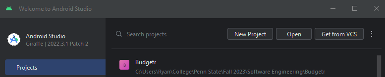

# Budgetr - Customizable Budget Planning App

## Table of Contents

- [Introduction](#introduction)

-  [Installation](#installation)
	-  [Java](#java-installation)
	- [Android Studio](#android-studio-installation)

-  [Configuration](#configuration)
	- [Important Info About Our App's Configuration](#important-info-about-our-apps-configuration)

- [Usage](#usage)
	- [Operational Use Cases](#operational-use-cases)

- [Features](#features)

- [Getting Started](#getting-started)
	- [Cloning the Project](#cloning-the-project)
   	- [Creating the Virtual Device](#creating-the-virtual-device)
	- [Building the Project](#building-the-project)
   	- [Running the Project](#running-the-project)
	- [Testing the Project](#testing-the-project)
	- [Using the App](#using-the-app)

- [Customization](#customization)

## Introduction

Budgetr is a user-friendly budget planning application designed to help you manage your finances with ease. Whether you're saving for a big purchase, paying off debt, or simply trying to gain better control of your money, Budgetr can help you achieve your financial goals.

With Budgetr, you can create and customize your budget plan according to your specific needs and financial goals. Track your income, expenses, and savings effortlessly, and gain valuable insights into your spending habits.

## Installation
Note: If you don't have Java JDK version 17 or higher, start at Java Installation step 1. Otherwise, go to [Android Studio Installation](#android-studio-installation) step 1.
### Java Installation
1. Download JDK version 17 or higher from the [Oracle](https://www.oracle.com/java/technologies/downloads/) website
2. Once downloaded, double-click the installer and follow the installation steps
3. In File Explorer, navigate to where the JDK installed and locate the JDK's "bin" folder and copy this file path. Do not close File Explorer.
4. 
5. Now on Windows, in the Search box at the bottom-left corner, enter "Edit the system environment variables."
6. 
7. Press the "Environment Variables..." button at the bottom-right of the System Properties page
8. 
9. On the Environment Variables page go to the System variables list, click on "Path," then click on "Edit..."
10. 
11. Click on the blank line underneath the very last file path in the list and paste the JDK's bin file path there, then close the window by clicking "OK." Note: the JDK-21 path was moved up one spot after being inserted at the bottom of the list. 
12. Back on the Environment Variables page, if you do not have a variable named "JAVA_HOME" in the User Variables list, go back to File Explorer and navigate to the "jdk-<version_number>" file and copy this file path
13. 
14. Back on the Environment Variables page, click "New" on the User Variables list
15. For the "Variable name" text field, enter JAVA_HOME
16. For the "Variable value" text field, paste the jdk-<version_number> file path, then click OK
17. 
18. After that, click OK on the Environment Variables page, then click OK on the System Properties page

### Android Studio Installation
1. To download the latest version of Android Studio, go to [Android Studio](https://developer.android.com/studio) website and select the download for your operating system
2. Once the download finishes, double-click the installer file and follow the steps in the Android Studio Setup.
3. After the Android Studio Setup finishes, Android Studio will automatically open with the Android Studio Setup Wizard
4. Select the Standard setup for Android Studio
5. Accept the Current Settings and License Agreements
6. After this, Android Studio will automatically download all necessary components. This will take a few minutes.
Note: Our group uses the new UI of Android Studio. To change to the new UI, File -> Settings -> Appearance & Behavior -> New UI then press "Enable new UI." Additionally, in the project pane to the on the left side of the Android Studio, it may be better to swtich from the Project option to the Android option and vice versa. For example, after running the command to generate KDocs, the Html pages can be found under app -> build -> dokka when using the Project view. This directory is not found under the Android view.

## Configuration
Our project was created using Android Studio, and, as of now, our project is configured to utilize Kotlin, Jetpack Compose, JUnit, Dokka, and Firebase. 
### Important Info About Our App's Configuration
- Android Studio version: Android Studio Giraffe version 2022.3.1 Patch 2
- Android Gradle Plugin Version: 8.1.2
- Gradle Version: 8.0
- Gradle JDK version: jbr-17 JetBrains Runtime version 17.0.6
- Kotlin Compiler version: 1.8.10
- Kotlin version: 1.9.0
- Jetpack Compose version: 1.3.2
- JUnit versions: 4.13.2, 5.10.0
- Dokka Gradle Plugin version: 1.9.10
- build.gradle (:app) compileSdk: 34
- build.gradle (:app) minSdk: 28
- build.gradle (:app) targetSdk: 34
- build.gradle (:app) sourceCompatibility: JavaVersion.VERSION_17
- build.gradle (:app) targetCompatibility: JavaVersion.VERSION_17
- build.gradle (:app) jvmTarget: 17

### Important Note About Building for the First Time
- If there is ever a build fail with an error message relating to compileSdk 33 and targetSdk 33, go to the build.gradle (:app) file and change the values for compileSdk and targetSdk from 33 to 34.
- Any build fails that result from non-supported Java versions, go to build.gradle (:app), and within compileOptions, change JavaVersion.<java_version> to JavaVersion.VERSION_17. Underneath kotlinOptions, change the value of jvmTarget to '17'. If there are still issues with the Java version, go to File -> Project Structure -> Modules, and in the Source Compatibility and Target Compatibility drop-downs, select Java 17.

## Usage

Budgetr is designed to be intuitive and user-friendly. Here's a quick overview of how to use the app:

1. **Create Your Budget:**

   - Start by setting up your budget by entering your income, expenses, and savings goals.

2. **Track Your Expenses:**

   - Log your expenses regularly and categorize them using predefined or custom categories.

3. **Monitor Your Progress:**

   - Keep an eye on your financial health with visual reports and charts.

4. **Notifications:**

   - Become notified when you are exceeding your spending limit(s).

5. **Adjust as Needed:**

   - Modify your budget as your financial situation changes, and your goals evolve.

### Operational Use Cases
1. Creating an expense category
The expense category allows the user to create custom categories for different expenses they may have. For example, a user can create the category "Food" and enter all expenses related to food for the app to track.
2. Bar Chart
The bar chart is for the user to get a visualization of their spending. The chart uses the information from the user's categories, such as the category name and money spent, to display this info alongside other categories.

## Features

- **Customizable Budget Plans:** Tailor your budget to match your unique financial situation and goals.

- **Expense Tracking:** Easily log and categorize your expenses to keep tabs on your spending.

- **Income Management:** Record your income sources and view your overall financial picture.

- **Savings Goals:** Set and monitor savings goals to achieve your financial objectives.

- **Visual Reports:** Gain insights through visual charts and reports to make informed financial decisions.

- **Expense Categories:** Pre-defined categories and the ability to add custom categories for accurate tracking.

- **Notifications:** Receive notifications of too much spending.

- **Secure Data:** Your financial data is securely stored and protected.

## Getting Started
### Cloning the Project
1. Open up Android Studio. When the "Welcome to Android Studio" screen appears, click on "Get from VCS" 
2. Copy the URL from the Budgetr GitHub repository and paste it into the "URL: https://github.com/ryandoyle5401/Budgetr" text field, then click "Clone" 
3. The project should start downloading and open automatically. Note: if a Windows Security Alert window pops up when the app opens, click "Allow access"

### Creating the Virtual Device
1. In Android Studio, go to Device Manager
 

2. Within Device Manager, click Create Device     
3. Under the Phone list, select the Pixel 5 phone, then click Next 
4. Under the System Image list, select Release Name: S, API Level 31, ABI x86_64, Target: Android 12.0 (Google APIs), then click Next  
5. Finally you can give the device a name, or leave it as its default name. Then click Finish  
6. To run the Virtual Device, under the Device Manager window, click the play button next to your virtual device's name. This will launch the emulator, NOT the application
 

### Building the Project
1. With the project opened, in the menu bar at the top, click Build -> Make Project to allow Gradle to automatically build the project 

### Running the Project
Note: There are two ways to launch the application. We find it better to use Option 2.
Option 1
1. Press the play button at the top of the Android Studio window, or go to File -> Run -> Run 'app' 
2. This should build the project, initialize the emulator, and then start the app on the emulator.

Option 2
1. Under Device Manager, click the play button next to your virtual device's name. This will only launch the virtual device. 
2. Once the virtual device is up and running, then press the play button at the top of the Android Studio window, or go to File -> Run -> Run 'app' 
3. With the emulator still running, once the project finishes building, the app should automatically appear on the emulator. 

### Testing the Project
1. In Android Studio, at the bottom-left of the screen, open a terminal   
2. For Windows, enter "gradlew.bat test". For Mac or Linux, use "./gradlew test". This command executes all tests in the project 
3. To see the results, in File Explorer, navigate to the location where Budgetr is stored. From there go to app/build/reports/tests/testDebugUnitTest/index.html to view the test result HTML page
 

### Using the App
When the app first starts running, the Expenses screen will be the first screen to pop up. At the bottom of the screen, there are four buttons that navigate to every screen: Expenses, Reports, Add, Settings.

#### Expenses Screen
The Expenses screen shows the user all expenses added together and broken down into each category. By default, it shows all expenses entered today, but the user can switch to see the all the expenses they entered for the past week, the past month, and the past year.  
 

#### Reports Screen
The Reports screen displays a bar chart and the expenses entered for the week, the month, or the entire year. Again, the expenses are listed by each individual category, and the bar chart displays the all expenses incurred on the day of the week, the day of the month, or the month of the year. 
 

#### Add Screen
The Add screen is where users can enter an expense amount, select how often the expense occurs, the date of the expense, any notes about the expense, and the selecting the category the expense fits in.
 

To add an expense, follow these steps:
1. Enter the amount of the expense at the top of the screen. Decimals are not necessary
2. Optionally enter how often this expense occurs
3. Optionally select the date that this expense occurs. By default, this value is the current date.
4. Optionally leave a note about the expense.
5. Select the category the expense belongs to.
6. Press the "Submit expense" button
 

#### Settings Screen
The Settings screen is where the user can go to edit their list of categories or delete all information on the app.
 
  
To create a new category, follow these steps:
1. At the bottom of the screen, click the text box with the text "Category name"
2. Enter the category name. For example, "Food"
3. Optionally add a color to associate with this category by clicking the white circle next to the text field, selecting a color, press "Done", then click the paper airplane button next to the text box to submit the category.
 

## Customization

Budgetr is all about flexibility. Here's how you can customize your budget plan:

- **Categories:** Add, edit, or delete expense categories to match your spending habits.

- **Income Sources:** Record all sources of income, including salaries, side hustles, and investments.

- **Budget Goals:** Set specific goals for different aspects of your financial life, such as an emergency fund or vacation savings.

- **Timeframes:** Adjust the timeframe of your budget, whether it's monthly, quarterly, or yearly.

---

Thank you for choosing Budgetr to help you manage your finances. We hope this app makes budgeting easy and effective for you. If you have any questions or encounter any issues, please don't hesitate to contact us. Happy budgeting!
